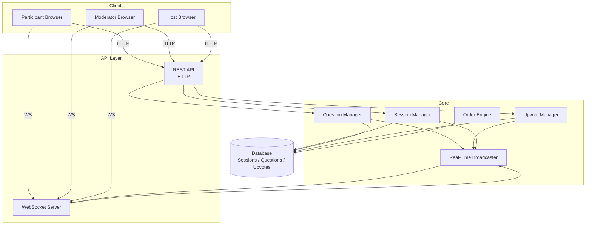
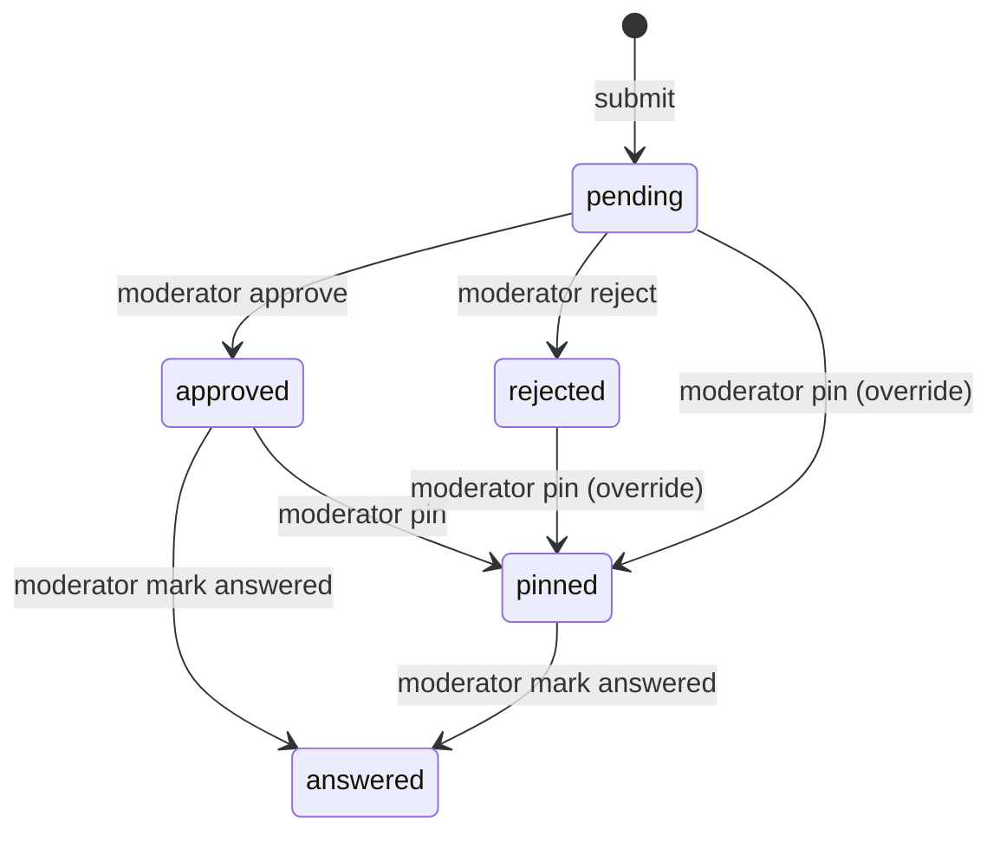

# Design Document: Question Pool Live Q&A

## Overview

The Question Pool Live Q&A system is a real-time audience interaction platform. Participants join a session via a shareable code, submit questions, and upvote others. Moderators curate the pool by approving, rejecting, pinning, or marking questions answered. The host sees a live-ordered view of the most relevant questions.

The system is event-driven at its core: state changes (new questions, upvotes, status transitions) propagate to all connected clients within 2 seconds via WebSocket push. The backend enforces all business rules (submission limits, upvote deduplication, status transition guards) and is the single source of truth.

### Key Design Decisions

- **WebSocket for real-time**: Persistent connections allow server-push without polling, meeting the 2-second update requirement.
- **Optimistic ordering on the server**: The server computes and broadcasts ordered question lists so all clients see a consistent view.
- **Session-scoped anonymous identity**: Participants get a UUID assigned at join time, stored client-side (e.g., localStorage), enabling re-join without accounts.
- **Status as a state machine**: Question status transitions are explicitly guarded to prevent invalid transitions.

---

## Architecture



The system follows a layered architecture:

- **REST API** handles mutations (create session, submit question, moderate, upvote) and initial data fetches.
- **WebSocket server** maintains persistent connections per session room and broadcasts state changes.
- **Core services** encapsulate business logic and are called by both the REST and WebSocket layers.
- **Order Engine** computes the canonical question ordering (pinned first, then by votes desc, then by timestamp asc).
- **Real-Time Broadcaster** fans out events to all session subscribers after any state change.

---

## Components and Interfaces

### Session Manager

Responsible for session lifecycle.

```
createSession(title: string, description?: string, anonymousAllowed: boolean) → Session
startSession(sessionId: string, hostId: string) → Session
endSession(sessionId: string, hostId: string) → Session
getSession(joinCode: string) → Session | NotFoundError
```

### Question Manager

Handles submission, moderation, and retrieval.

```
submitQuestion(sessionId: string, participantId: string, text: string) → Question | ValidationError
approveQuestion(questionId: string, moderatorId: string) → Question | StatusError
rejectQuestion(questionId: string, moderatorId: string) → Question | StatusError
pinQuestion(questionId: string, moderatorId: string) → Question
markAnswered(questionId: string, moderatorId: string) → Question
getVisibleQuestions(sessionId: string) → Question[]   // ordered per Req 5
```

### Upvote Manager

Enforces per-participant, per-question upvote uniqueness.

```
upvote(questionId: string, participantId: string) → UpvoteResult | UpvoteError
getUpvoteCount(questionId: string) → number
```

### Order Engine

Pure function — no side effects.

```
orderQuestions(questions: Question[]) → Question[]
// pinned first, then approved sorted by (upvotes DESC, submittedAt ASC)
```

### Real-Time Broadcaster

```
broadcast(sessionId: string, event: SessionEvent) → void
subscribe(sessionId: string, connectionId: string) → void
unsubscribe(connectionId: string) → void
```

### Session Join Handler

```
joinSession(joinCode: string, participantId?: string) → JoinResult | JoinError
// assigns anonymous ID if not provided and anonymous mode is on
```

---

## Data Models

### Session

```typescript
interface Session {
  id: string;                    // UUID
  joinCode: string;              // short unique code, e.g. "ABC123"
  title: string;
  description?: string;
  hostId: string;
  status: "created" | "open" | "closed";
  anonymousAllowed: boolean;
  createdAt: Date;
  startedAt?: Date;
  endedAt?: Date;
}
```

### Question

```typescript
interface Question {
  id: string;                    // UUID
  sessionId: string;
  participantId: string;         // anonymous UUID or authenticated user ID
  text: string;                  // 1–300 characters
  status: QuestionStatus;
  upvoteCount: number;
  submittedAt: Date;
  lastModifiedAt: Date;
  lastModifiedBy?: string;       // moderator ID
}

type QuestionStatus = "pending" | "approved" | "rejected" | "answered" | "pinned";
```

### Question Status Transitions



### Upvote

```typescript
interface Upvote {
  questionId: string;
  participantId: string;
  sessionId: string;
  createdAt: Date;
}
// Unique constraint: (questionId, participantId)
```

### ModerationEvent

```typescript
interface ModerationEvent {
  id: string;
  questionId: string;
  moderatorId: string;
  fromStatus: QuestionStatus;
  toStatus: QuestionStatus;
  timestamp: Date;
}
```

### SessionEvent (WebSocket payload)

```typescript
type SessionEvent =
  | { type: "question_approved"; question: Question }
  | { type: "question_pinned"; question: Question }
  | { type: "question_answered"; question: Question }
  | { type: "upvote_updated"; questionId: string; upvoteCount: number }
  | { type: "session_closed" }
  | { type: "session_state"; questions: Question[] };  // sent on reconnect
```

### JoinResult

```typescript
interface JoinResult {
  session: Session;
  participantId: string;   // existing or newly assigned
  questions: Question[];   // current visible questions
}
```


---

## Correctness Properties

*A property is a characteristic or behavior that should hold true across all valid executions of a system — essentially, a formal statement about what the system should do. Properties serve as the bridge between human-readable specifications and machine-verifiable correctness guarantees.*

### Property 1: Session creation round-trip

*For any* valid title and optional description, creating a session should produce a session whose title and description match the inputs exactly, and whose join code is non-empty.

**Validates: Requirements 1.1, 1.4**

---

### Property 2: Session lifecycle state transitions

*For any* created session, starting it should set status to `open`, and subsequently ending it should set status to `closed`. A closed session must reject new question submissions.

**Validates: Requirements 1.2, 1.3, 1.6**

---

### Property 3: Join code uniqueness

*For any* collection of independently created sessions, all join codes must be pairwise distinct.

**Validates: Requirements 1.4**

---

### Property 4: Question length validation

*For any* string of length between 1 and 300 characters (inclusive), submitting it to an open session should succeed. *For any* string of length 0 or greater than 300 characters, submission should be rejected with a validation error.

**Validates: Requirements 2.1, 2.2**

---

### Property 5: Question ID uniqueness and initial status

*For any* set of questions submitted to a session, all question IDs must be pairwise distinct, all timestamps must be non-null, and every question's initial status must be `pending`.

**Validates: Requirements 2.3, 2.5**

---

### Property 6: Moderation status transitions

*For any* pending question, approving it must set status to `approved` and rejecting it must set status to `rejected`. *For any* question in any status, pinning it must set status to `pinned`. *For any* approved or pinned question, marking it answered must set status to `answered`.

**Validates: Requirements 3.1, 3.2, 3.3, 3.4**

---

### Property 7: Moderation audit trail

*For any* question status change performed by a moderator, the resulting moderation event must contain the moderator's identifier and a non-null timestamp.

**Validates: Requirements 3.6**

---

### Property 8: Upvote deduplication and accurate count

*For any* participant and any eligible question, upvoting multiple times must result in the upvote count increasing by exactly 1, and any subsequent upvote attempt must be rejected with an error. The stored upvote count must always equal the number of distinct participants who have upvoted.

**Validates: Requirements 4.2, 4.3, 4.4**

---

### Property 9: Upvote eligibility guard

*For any* question in `pending`, `rejected`, or `answered` status, an upvote attempt must be rejected with an eligibility error. *For any* question in `approved` or `pinned` status in an open session, a first upvote must succeed.

**Validates: Requirements 4.1, 4.5**

---

### Property 10: Visible question filtering

*For any* session containing questions in various statuses, the list of visible questions returned to any client (host, moderator, or participant) must contain only questions with status `approved` or `pinned`.

**Validates: Requirements 5.1, 5.4**

---

### Property 11: Question ordering invariant

*For any* list of approved and pinned questions, the `orderQuestions` function must produce a list where: all `pinned` questions appear before all `approved` questions; `approved` questions are sorted by upvote count descending; and among `approved` questions with equal upvote counts, questions are sorted by submission timestamp ascending.

**Validates: Requirements 5.2, 5.3**

---

### Property 12: Reconnection delivers full state

*For any* session with any set of visible questions, a participant who reconnects must receive all currently visible questions (approved and pinned) in the correct order.

**Validates: Requirements 6.4**

---

### Property 13: Join code round-trip

*For any* created session, using its join code must grant access to that exact session. *For any* string that is not a valid join code, the join attempt must be rejected with an error.

**Validates: Requirements 7.1, 7.2**

---

### Property 14: Anonymous participant identity assignment

*For any* anonymous-enabled session, joining without credentials must return a non-null session-scoped participant identifier.

**Validates: Requirements 7.3**

---

### Property 15: Re-join idempotence

*For any* participant who has submitted questions and upvotes in a session, re-joining with the same join code must return the same participant identifier, and all previously submitted questions and upvotes must remain associated with that participant.

**Validates: Requirements 7.4**

---

## Error Handling

### Validation Errors

| Scenario | Error Type | Response |
|---|---|---|
| Question text empty or >300 chars | `ValidationError` | 400 with field-level message |
| Invalid/expired join code | `JoinError` | 404 with "session not found" message |
| Submit to closed session | `SessionClosedError` | 409 with "session is closed" message |
| Duplicate upvote | `DuplicateUpvoteError` | 409 with "already upvoted" message |
| Upvote ineligible question | `UpvoteEligibilityError` | 422 with status-specific message |

### State Transition Guards

- Approve/reject on non-pending question: return a `ReconfirmationRequired` response (HTTP 409) with the current status, prompting the caller to confirm the action.
- Pin is always allowed regardless of current status (no guard needed).
- Mark answered is allowed from `approved` or `pinned` only; other statuses return a `TransitionError`.

### Real-Time Failure Handling

- If a WebSocket broadcast fails for a subset of connections, the server logs the failure and retries once. Clients that miss an event will receive the full current state on reconnect via the `session_state` event.
- If the WebSocket connection drops, the client should attempt exponential backoff reconnection (starting at 1s, max 30s).

### Concurrency

- Upvote deduplication uses a unique constraint on `(questionId, participantId)` at the database level to prevent race conditions.
- Status transitions use optimistic locking (version field on Question) to prevent conflicting concurrent moderator actions.

---

## Testing Strategy

### Dual Testing Approach

Unit tests cover specific examples, edge cases, and error conditions. Property-based tests verify universal properties across all inputs. Both are necessary for comprehensive coverage.

### Property-Based Testing

**Library**: [fast-check](https://github.com/dubzzz/fast-check) (TypeScript/JavaScript) or [hypothesis](https://hypothesis.readthedocs.io/) (Python), depending on the implementation language.

Each property test must:
- Run a minimum of **100 iterations**
- Be tagged with a comment referencing the design property:
  `// Feature: question-pool-live-qna, Property N: <property_text>`
- Test the pure logic layer (Order Engine, validation functions, status transition guards) without I/O

**Properties to implement as property-based tests:**
- Property 1: Session creation round-trip (generators: random titles, optional descriptions)
- Property 3: Join code uniqueness (generator: list of N sessions)
- Property 4: Question length validation (generators: strings of length 1–300 and strings of length 0 or >300)
- Property 5: Question ID uniqueness and initial status (generator: batch of N submissions)
- Property 6: Moderation status transitions (generators: questions in various statuses)
- Property 7: Moderation audit trail (generator: random moderator IDs and status changes)
- Property 8: Upvote deduplication and accurate count (generator: random participant/question pairs with repeated upvote attempts)
- Property 9: Upvote eligibility guard (generator: questions in each ineligible status)
- Property 10: Visible question filtering (generator: questions in all possible statuses)
- Property 11: Question ordering invariant (generator: random lists of approved/pinned questions with varying upvote counts and timestamps)
- Property 14: Anonymous participant identity assignment (generator: anonymous-enabled sessions)
- Property 15: Re-join idempotence (generator: participants with random question/upvote histories)

### Unit Tests

Focus on:
- Specific examples of each status transition (happy path and error path)
- Edge cases: exactly 1 character, exactly 300 characters, 301 characters
- Reconfirmation behavior when approving/rejecting non-pending questions
- Session closed error on submission
- Invalid join code rejection

### Integration Tests

For real-time requirements (Properties not suitable for PBT):
- **6.1–6.3**: Verify that WebSocket broadcast is sent to all subscribers within 2 seconds when a question is approved, upvoted, pinned, or answered. Use a test WebSocket client.
- **5.5**: Verify that the ordered question list updates within 2 seconds of a status or upvote change.
- **6.4 / Property 12**: Verify reconnection delivers full current state (can also be tested as a property with mocked WebSocket).

### Test Organization

```
tests/
  unit/
    session-manager.test.ts
    question-manager.test.ts
    upvote-manager.test.ts
    order-engine.test.ts
  property/
    session.property.test.ts
    question-validation.property.test.ts
    moderation.property.test.ts
    upvote.property.test.ts
    ordering.property.test.ts
    join.property.test.ts
  integration/
    realtime-broadcast.test.ts
    reconnection.test.ts
```
